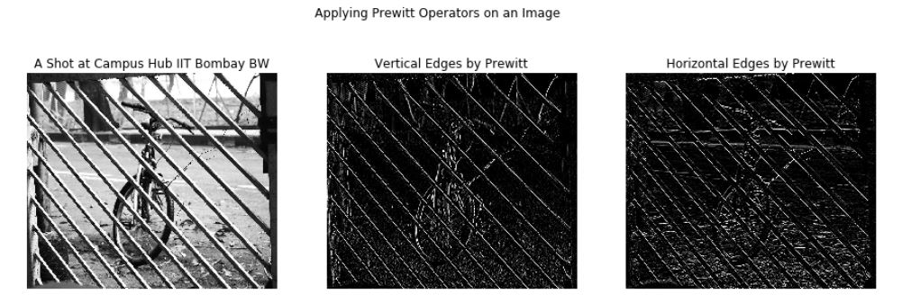
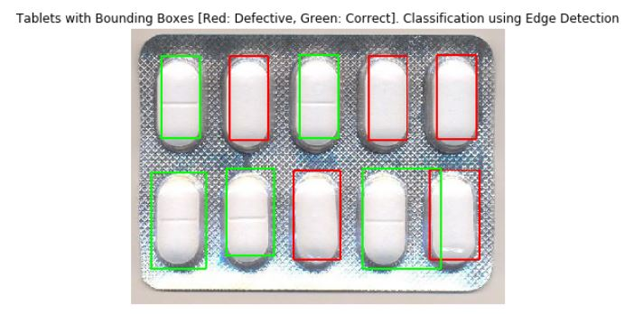
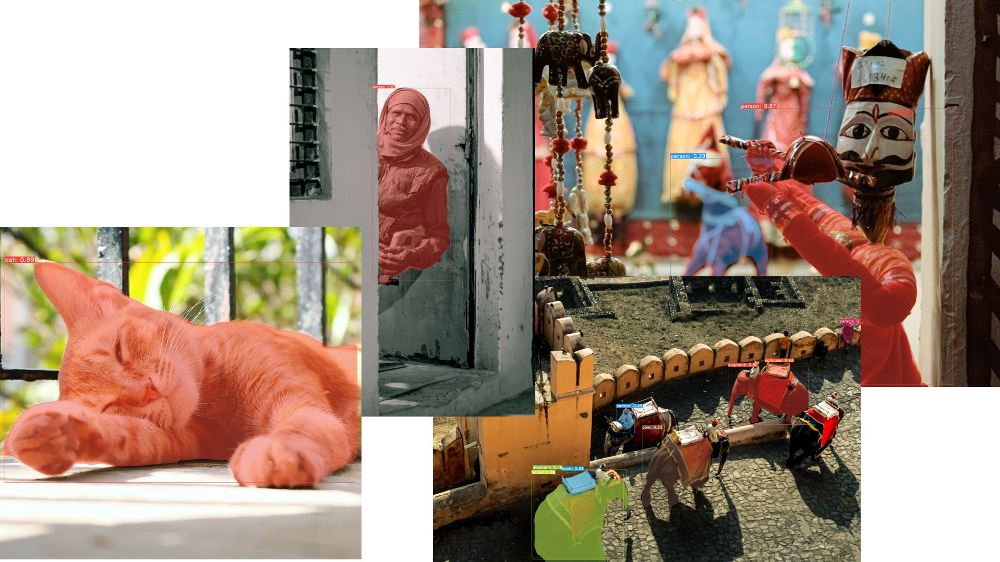

# A Notebook Series on Computer Vision

## Highlights

<figure>
    
    <figcaption style = "text-align:center">Spatial Resolution
    </figcaption>
</figure>

<figure>
    
    <figcaption style = "text-align:center">Image and its Histogram
    </figcaption>
</figure>

<figure>
    
    <figcaption style = "text-align:center">Detecting Edges using Prewitt Operator
    </figcaption>
</figure>

<figure>
    
    <figcaption style = "text-align:center">Classifying Defective Tablets using Edge Detection. Ref: https://stackoverflow.com/questions/30174233/how-to-tell-the-number-of-defective-tablets-using-matlab
    </figcaption>
</figure>

<figure>
    
    <figcaption style = "text-align:center">Segmentation Using Deep Neural Network
    </figcaption>
</figure>

## Acknowledgement

I dedicate this work to my teacher [Prof. B. Krishna Mohan](http://www.csre.iitb.ac.in/bkmohan/), who is the source of whatever little I know of this amazing field called Computer Vision and under whom I have completed my master's degree.

## About the Content

This notebook series is a collection of Jupyter notebooks organized in chapters, covering some of the most interesting and useful topics of Computer Vision.

This series focuses on presenting concepts as organically connected tools to solve different problems related to RGB images. And give to develop an understanding in the reader about how different concepts are tied together to implement one image analytics solution.

The notebooks presented here are a blend of theory and code to balance between understanding and implementation.

## Objectives

The objective of this notebook series is to make the reader comfortable with different concepts of image processing using traditional and neural network based techniques.

## Software Pre-requisites

You will need a Python environment with OpenCV, Jupyter notebooks, Keras, Tensorflow installed.

Use the requirements.txt in the repo.

## Knowledge Pre-requisites

Working knowledge of Python and Jupyter notebooks is essential for this course. Hands-on experience with OpenCV and Keras will also be helpful.

## Tutorial Outline

- Chapter 1 - Foundation
  - [Why Computer Vision](1_foundation/00_why_computer_vision.ipynb)
  - [How Do Computers See Images](1_foundation/01_how_do_computers_see_images.ipynb)
  - [Image Properties](1_foundation/.ipynb_checkpoints/02_image_properties-checkpoint.ipynb)
  - [Basic Operations on Images](1_foundation/.ipynb_checkpoints/03_basic_operations_on_images-checkpoint.ipynb)
  
- Chapter 2 - Neighborhood Operations
  - [Neighborhood Operations](2_neighborhood_ops/01_neighborhood_operations.ipynb)
  - [Edge Detection](2_neighborhood_ops/02_edge_detection.ipynb)
  - [Morphological Operations](2_neighborhood_ops/03_morphological_operations.ipynb)
  
- Chapter 3 - Image Segmentation
  - [Introduction to Image Segmentation](3_segmentation/00_introduction_to_image_segmentation.ipynb)
  - [Non Contextual Techniques](3_segmentation/01_non_contextual_techniques.ipynb)
  - [Evaluate Segmentation Results](3_segmentation/02_evaluate_segmentation_results.ipynb)
  - [Deep Neural Network Segmentation Techniques](3_segmentation/03_deep_segmentation_techniques.ipynb)
  - [Segmentation Models](3_segmentation/04_segmentation_models_aug.ipynb)
  
- Chapter 4 - Video Analytics
  - [Let's Add Time Dimension](4_video_analytics/00_lets_add_time_dimension.ipynb)
  - [Let's Do Some Video Analysis](4_video_analytics/01_lets_do_some_video_analysis.ipynb)
  - [CV For Videos](4_video_analytics/02_cv_for_videos.ipynb)

## About the Author

Ankur Shukla is a Data Science Analyst at Deloitte Consulting. He consult clients from different industries on their data science problems. Python is his bread and butter and he uses it extensively for his day to day machine learning and data analysis tasks. Ankur is a postgraduate from CSRE, IIT Bombay in Geoinformatics and Natural Resources Engineering. Majority of his work at CSRE was focused in satellite image processing using Python.

[LinkedIn](https://www.linkedin.com/in/thisisashukla), [Twitter](https://www.twitter.com/thisisashukla/)
